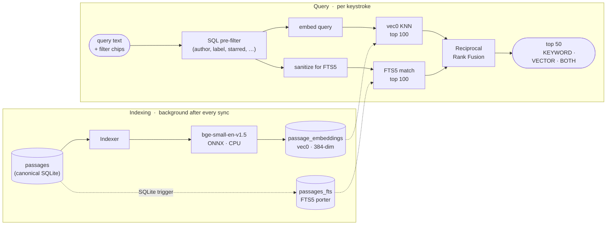

# Archi

Archi is a local-first macOS desktop app that syncs Kindle highlights and notes into Notion.

## What is implemented

- Electron + Vite + React desktop shell with six MVP screens.
- Local SQLite canonical store (`works`, `passages`, `sync_jobs`).
- Device export ingestion for Kindle clippings.
- Notion destination with first-run database auto-provisioning.
- Unified connection manager for provider setup and status.
- Scheduled sync loop and manual "Sync now".
- Cloud notebook connector scaffolding with Playwright and auth state tracking.
- Local semantic search over passages: hybrid retrieval (vec0 KNN + FTS5)
  fused with RRF, embedded with a bundled bge-small-en-v1.5 ONNX model.
  No network calls; works offline. See [Local semantic search](#local-semantic-search).

## Monorepo layout

- `apps/desktop`: Electron app (main, preload, renderer).
- `packages/core`: schema types, db migrations, dedupe, sync state model.
- `packages/source-device-export`: parser and normalization for local export files.
- `packages/source-cloud-notebook`: cloud notebook connector.
- `packages/destination-notion`: Notion database setup and upsert workflow.
- `packages/search`: embedder, indexer, hybrid query service.
- `packages/ui`: shared React UI pieces.

## Local semantic search

Hybrid retrieval over your synced passages. A bundled
`bge-small-en-v1.5` ONNX model (~32 MB, INT8 quantized) embeds passages
into 384-dim vectors stored in a sqlite-vec `vec0` virtual table alongside
the canonical `passages` table. Queries fan out to both vec0 KNN and FTS5
in parallel and a Reciprocal Rank Fusion combines the rankings. Results
are tagged `KEYWORD`, `VECTOR`, or `BOTH` so you can tell what matched.



**Why hybrid:** vec0 catches paraphrases (a query for *frustration* surfaces
passages about *anger* and *impatience*); FTS5 catches proper nouns and exact
phrases that embeddings underrank. The SQL pre-filter step is the win over
FAISS-style stores — KNN runs *within* the filtered subspace, so recall
stays 1.0 even on very selective filter combinations.

**Three ways to use it:**

- `⌘K` anywhere in the app — global search bar, top 5 hits in a dropdown,
  `↵` opens the full Search screen, `⌘↵` opens with filters expanded.
- The Search screen (sidebar icon) — empty box browses all passages,
  typing triggers hybrid ranking, `+ Add filter` chips for author/book/
  label/starred/date.
- **Find similar** button on any passage — KNN nearest neighbors of that
  passage's embedding, no query text needed.

**Indexing:** ticks automatically after every sync and on the
`passages_au` trigger when a body is edited. Initial backfill is one-shot
and runs on the Electron main thread (~1 minute per ~3k passages on
Apple Silicon). Manual "Start indexing" button lives in Search settings.

See `docs/superpowers/specs/2026-06-02-local-rag-semantic-search-design.md`
for the full design and tradeoff log.

## Environment

Copy `.env.example` to `.env` and fill values:

- `NOTION_INTEGRATION_TOKEN` (optional: can be a Notion PAT or an internal integration token; you can also paste it in-app in Connections)
- `NOTION_PARENT_PAGE_ID`
- `CLOUD_SYNC_ENABLED`
- `CLOUD_NOTEBOOK_URL`
- `SYNC_INTERVAL_HOURS`

By default, use the in-app token flow: paste your Notion token once in Connections, then it is migrated into encrypted local credential storage and reused across restarts.
You can use either:
- a personal access token (PAT) for personal/local workflows
- an internal integration token if you prefer integration-based access
OAuth environment variables remain optional advanced settings.

## Local development

```bash
pnpm install
pnpm healthcheck
pnpm dev
```

`pnpm dev` starts the full desktop loop: renderer dev server, main/preload TypeScript watchers, and Electron with `VITE_DEV_SERVER_URL` set.

If you only need renderer UI work:

```bash
pnpm dev:renderer
```

## Local desktop quickstart

1. Ensure Node version matches `.nvmrc` (for `better-sqlite3` and Electron consistency).
2. Copy `.env.example` to `.env`.
3. Either:
   - paste Notion token in-app in Connections, or
   - set `NOTION_INTEGRATION_TOKEN` in `.env` for first run bootstrap.
4. Run `pnpm healthcheck` to validate Electron/Playwright/tooling before launching.
5. Run `pnpm dev`.

If cloud notebook connect reports missing Playwright browsers, install Chromium once:

```bash
pnpm --filter @archi/source-cloud-notebook exec playwright install chromium
```

## Cloud notebook auth persistence

Cloud notebook auth uses both:

- a persistent Chromium profile directory (default: `~/.archi-cloud-profile`)
- a Playwright storage state snapshot (default: `~/.archi-cloud-storage-state.json`)

On startup, Archi validates the persisted browser session before reporting cloud status. If the provider still shows `needs_action`, run **Reconnect** once and complete Amazon sign-in in the opened browser window.

If auth appears to drop repeatedly:

- verify Chromium was installed via Playwright (`pnpm healthcheck`)
- avoid deleting the profile/state files between app launches
- complete all login/MFA redirects before closing the reconnect browser window

## Quality checks

```bash
pnpm typecheck
pnpm test
pnpm lint
```

## macOS signing and notarization

`apps/desktop` is configured for hardened runtime + entitlements and runs notarization automatically during packaging when Apple credentials are present in the environment.

Required environment variables:

- `APPLE_ID`
- `APPLE_APP_SPECIFIC_PASSWORD` (app-specific password from Apple ID settings)
- `APPLE_TEAM_ID`
- `CSC_NAME` (the exact `Developer ID Application` identity label in your keychain)

Recommended one-time setup:

```bash
# Inspect available signing identities
security find-identity -v -p codesigning
```

Then package:

```bash
pnpm --filter @archi/desktop package
```

If those environment variables are not set, packaging still works but notarization is skipped.
